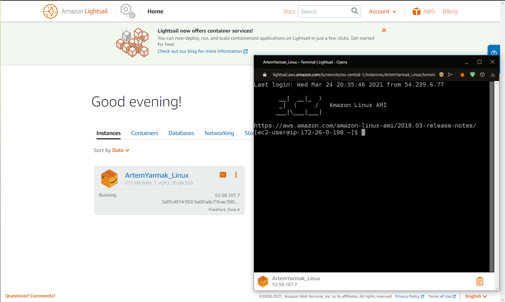

 Linux Machine created on Lightsail - task 4

 

 Created VM on CentOS  - task 5

 

 First created instance

 

 Created and attached Disk D - task 7

 

 Three created instances - task 8

 

 Launched WordPress on Amazon Lightsail - task 10

 

 Created bucket - task 11

 

 http://yarmakbucket.s3-website.eu-central-1.amazonaws.com - task 15