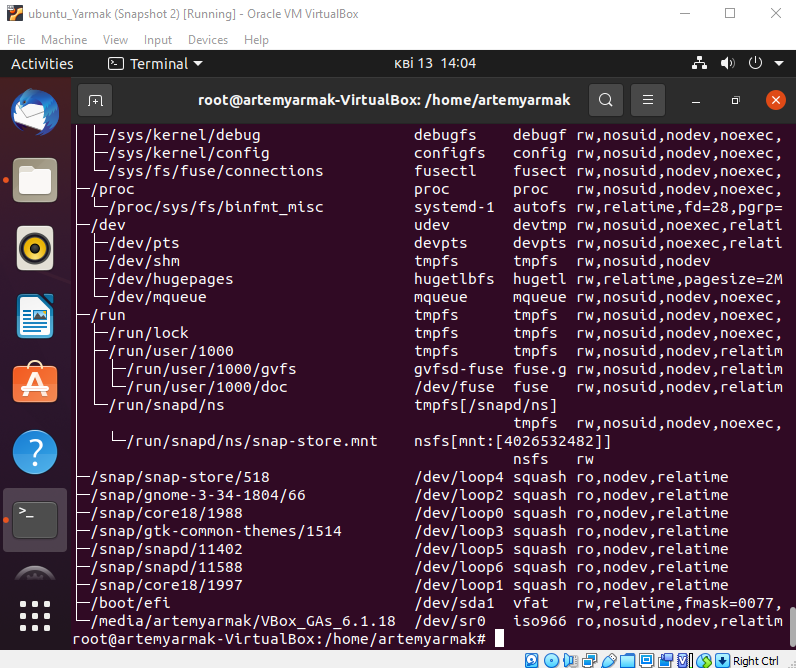

 Part 1 task 1
 
 
 
 task 2 
 
 

 task 3 

 

 task 4 

 

 task 5 
 For passwd command we have such additional options as -d/--delete which can be used
 for deleting user password
 -h/--help command which can be used to show brief information line of options

 For chfn command we can use -f/--full-name command to change full user name
 -u/--help use to show brief information line of options for chfn

 
 

 task 7 
 
 In part 1 i explore how to change password,change personal information and command 
 "man" which can help find more information about any commands

 task 8 

 

 Part 2 task 1

 

 taks 3
 We can use command "cd" to go back to home directory
 
 

 task 4
 "ls -la" command shows name of files,type of files,access rights,user which own file,
 size of files and time of last changes
 
 

 task 5 

 

 task 6
 After deleting "labwork2" file symbolic link became unable because the file path 
 is gone

 
 

 task 7
 
 

 task 8

 

 task 10

 

 task 11

 

 task 12 

 