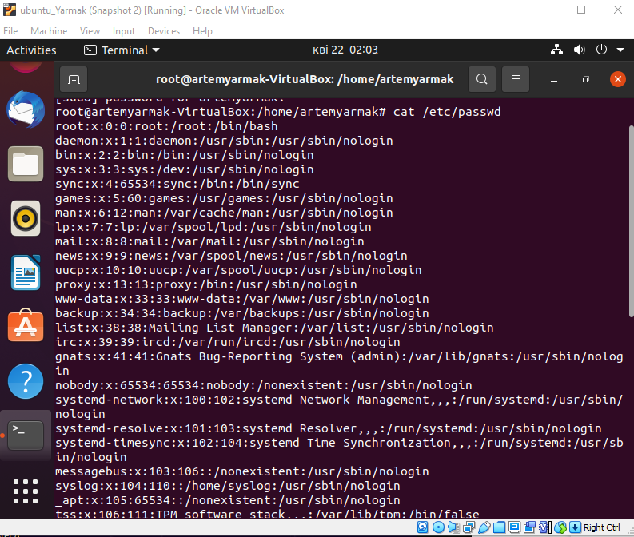
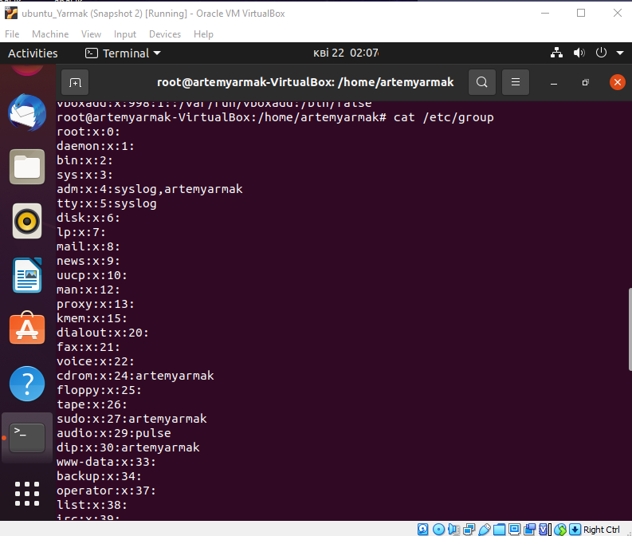
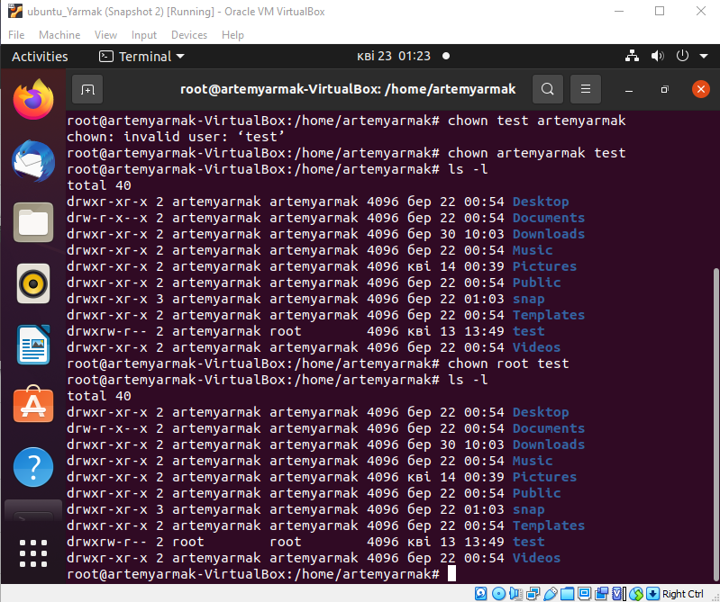
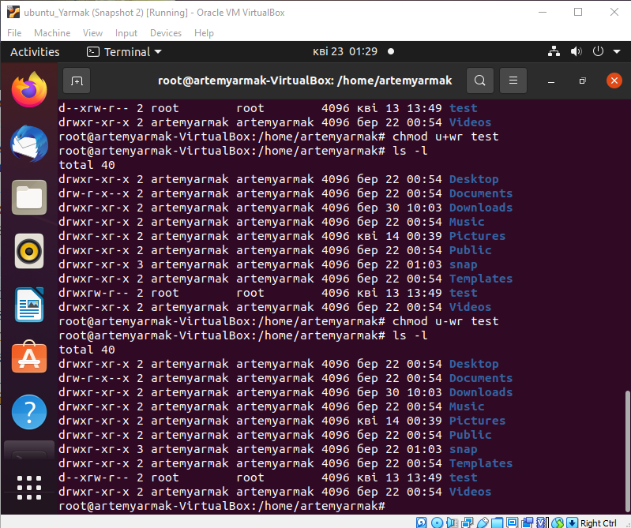

 Task 1
 
 
 

 Task 2
 UID ranges from 0 to 65535 
 UID is unique identifier of the user within the system
 To define UID we can use command /etc/passwd and see UID it third column

 Task 3
 
 GID is unique identifier of the group within the system to which the user belongs
 To define GID we can use command /etc/passwd and see it in fourth column
 
 Task 4
 
 Use command libuser-lid username

 Task 5

 Command for adding user to the system - useradd
 Basic parameters for creating user - [-c uidcomment] [-d dir] [  -e expire] [-f inactive] [-g gid] [  -m [-k skel_dir]]
 [-s shell][-u uid[-o]] username

 Task 6 

 To change acount name use command - usermod -l newname currentname

 Task 7 

 skel_dir - command which contains files which must be copied to the new users home 
 directory

 Task 8

  Use command userdel -r username

 Taks 9

 To lock user account - usermod -l username
 To unlock user account - usermod -u username

 Task 10

 To remove a user's password and provide him with a password-free login
 for subsequent password change use command - usermod -d username

 Task 12

 Exists three roles owner,group,other

 Task 13  

 If the UID of the file is the same as the UID of the process,the user is the owner 
 of the file
 If the GID of the file matches the GID of any group the user belongs to,he is a 
 member of the group to which the file belongs.
 If neither the UID no the GID of a file overlaps with the UID of the process and 
 the list of groups that the user running it belongs to,that user is an outsider.

 Task 14 

 To change the owner of a file  use command chown username file
 
 To change mode of access to the file use command - chmod
 

 Task 15 

 Umask is a command that determines the settings of a mask that controls how file 
 permissions are set for newly created files

 Task 16 

 Sticky Bit is mainly used on folders in order to avoid deletion of a folder and its
 content byo ther users though they having write permissions on the folder contents

 
 
 
 